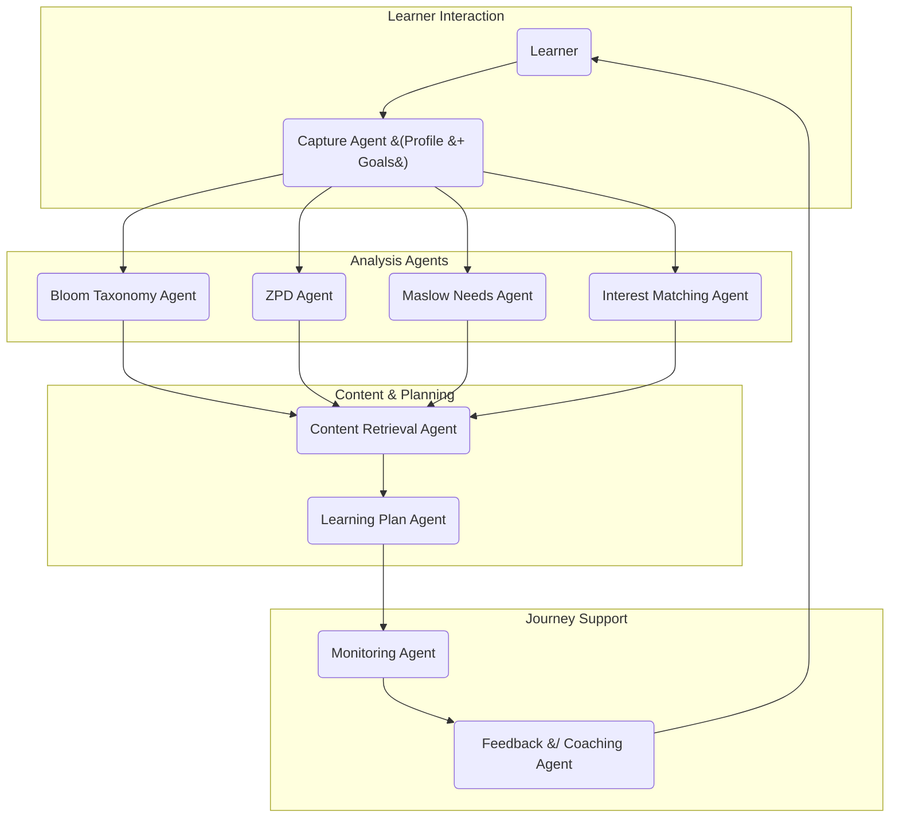
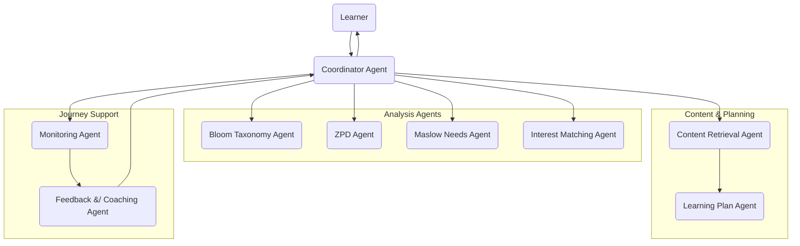

```mermaid
graph TD
    subgraph Learner Interaction
        L1(Learner)
        A1(Capture Agent &#40;Profile &#43; Goals&#41;)
        L1 --> A1
    end

    subgraph Analysis Agents
        A2(Bloom Taxonomy Agent)
        A3(ZPD Agent)
        A4(Maslow Needs Agent)
        A5(Interest Matching Agent)
    end

    A1 --> A2
    A1 --> A3
    A1 --> A4
    A1 --> A5

    subgraph Content & Planning
        A6(Content Retrieval Agent)
        A7(Learning Plan Agent)
    end

    A2 --> A6
    A3 --> A6
    A4 --> A6
    A5 --> A6
    A6 --> A7

    subgraph Journey Support
        A8(Monitoring Agent)
        A9(Feedback &#47; Coaching Agent)
    end

    A7 --> A8
    A8 --> A9
    A9 --> L1


```

```mermaid
graph TD
    L1(Learner)
    CA(Coordinator Agent)

    L1 --> CA

    subgraph Analysis Agents
        A2(Bloom Taxonomy Agent)
        A3(ZPD Agent)
        A4(Maslow Needs Agent)
        A5(Interest Matching Agent)
    end

    subgraph Content & Planning
        A6(Content Retrieval Agent)
        A7(Learning Plan Agent)
    end

    subgraph Journey Support
        A8(Monitoring Agent)
        A9(Feedback &#47; Coaching Agent)
    end

    CA --> A2
    CA --> A3
    CA --> A4
    CA --> A5
    CA --> A6
    A6 --> A7
    CA --> A8
    A8 --> A9
    A9 --> CA
    CA --> L1

```