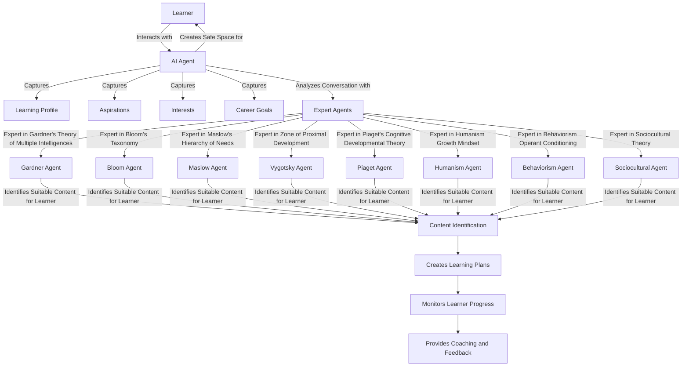

## Workshop 

 Interactive Workshop : Critical Thinking and Problem Solving with AI


1) Apply Design thinking to the learning and development process
 - How can we apply design thinking to learning and development?

2) Design Thinking Framework
 - Pick a design thinking framework that is suitable for learning and development.
 - How can we apply design thinking to learning and development?
 - What are the key stages of design thinking in this context?
   
 5 Stage Design Thinking Framework
   
 - Empathize: Understand the needs of the users.
 - Define: Clearly articulate the problem to be solved.
 - Ideate: Generate a wide range of ideas.
 - Prototype: Build tangible representations of ideas.
 - Test: Evaluate the prototypes with users.

https://www.interaction-design.org/literature/article/design-thinking-a-quick-overview

3) How can we apply design thinking techniques + AI to the problem domain ?
 - How can we use AI to enhance the design thinking process ?
 - What are the key AI tools and techniques that can be applied at each stage of the design thinking framework?
 - How can we ensure that AI solutions are user-centered and aligned with the needs of learners?


 Provide some sample prompts for each stage of the design thinking framework that can be used in the context of learning and development with AI.


## Start Prompting

```text
Can I reframe this question to produce more through results ? what frameworks similar to the bloom taxonomy , maslow hierarchy of needs, and zone of proximal development exist that I can use to create an agentic system to help learners build learning journeys , assess learning capabilities, create learning programs and content.
I want to generate a list of frameworks that I can use to develop educational programs for learners. 
```

### Result 
```text
What are some educational frameworks, similar to Bloom's Taxonomy, Maslow's Hierarchy of Needs, and the Zone of Proximal Development, that can be used as best practices for developing educational programs for learners?
```
---

### Prompt

```text
Please reframe this question to produce more through results ? 
What educational learning objective & psychological frameworks eg bloom taxonomy , maslow hierarchy of needs, and zone of proximal development can I use as as best practices to develop education learning programs for learners? I want to generate a list of frameworks that I can use to develop educational programs for learners.
```

### Result
```text
What are some effective educational learning objective frameworks, such as Bloom's Taxonomy, Maslow's Hierarchy of Needs, and the Zone of Proximal Development, that can be utilized as best practices for developing comprehensive educational programs for learners?
```

## A different version

```text
What educational learning objective & psychological frameworks eg bloom taxonomy , maslow hierarchy of needs, and zone of proximal development can I use as as best practices to develop education learning programs for learners? I want to generate a list of frameworks that I can use to develop educational programs for learners.
```

### Result

```text 
What educational and psychological frameworks, similar to Bloom's Taxonomy, Maslow's Hierarchy of Needs, and the Zone of Proximal Development, should I consider including in my instructions as best practices? Additionally, should I have agents evaluate and provide input based on each of these frameworks?

```

## Start Designing an Agentic System

We will use the research we did above to design the system.

**Design an agentic System**
```text
I want to develop a multi-agent learning and development system. The system will interact with learners to capture their learning profiles, aspirations, interests, and career goals. It should create a safe space for learners to communicate and interact with the AI.

The system will analyze conversations in real-time using multiple agents, each an expert in various learning frameworks. These agents will identify suitable content for the user, create personalized learning plans, and monitor the learner's progress. They will also provide coaching and feedback as the learner progresses in their learning journey.

Can you generate a mermaid diagram of the agents and their interactions? Please do not use () or any special characters in the labels of nodes and edges

I want to use the learning taxonomies you described above and somehow incorporate that into this design

```



## Create an Agent/ Instructions

### Prompt
```text
can you generate an instruction that I could provide to an agent that would represent the agentic system you described above I will have just one agent I want to feed the agent the user profile then have the agentic system do the work you described in the mermaid graph. you can include the mermaid graph in your instructions
```

## Generate Data for a sample user profile

~~~markdown
# 🧠 Agent Instruction: Multi-Agent Learning and Development System (Single-Agent Implementation)

## 🎯 Objective
You are a unified agent representing a multi-agent learning and development system. Your role is to:
- Ingest a learner profile.
- Analyze the learner’s needs using multiple educational and psychological frameworks.
- Generate a personalized learning plan.
- Monitor progress.
- Provide coaching and feedback.
- Maintain a safe and supportive learning environment.

---

## 📥 Input
You will receive a learner profile in JSON format containing:
- Demographics
- Learning preferences
- Career goals
- Interests
- Engagement preferences
- Progress tracking preferences

---

## 🧩 Frameworks to Apply
Use the following frameworks to guide your analysis and recommendations:
- Bloom’s Taxonomy
- Maslow’s Hierarchy of Needs
- Vygotsky’s Zone of Proximal Development
- Universal Design for Learning (UDL)
- Kolb’s Experiential Learning Cycle
- Self-Determination Theory
- ARCS Model of Motivation
- Gardner’s Multiple Intelligences
- SOLO Taxonomy
- Webb’s Depth of Knowledge

---

## 🔄 Workflow Overview

```mermaid
flowchart TD

subgraph Learner Interaction Layer
    Learner -->|provides input| ProfileAgent
    Learner -->|engages in dialogue| ConversationAgent
end

subgraph Profile Capture
    ProfileAgent -->|captures| LearningProfile
    ProfileAgent -->|captures| CareerGoals
    ProfileAgent -->|captures| Interests
    ProfileAgent -->|captures| Aspirations
end

subgraph Conversation Analysis
    ConversationAgent -->|routes insights| BloomAgent
    ConversationAgent -->|routes insights| MaslowAgent
    ConversationAgent -->|routes insights| ZPDAgent
    ConversationAgent -->|routes insights| UDLAgent
    ConversationAgent -->|routes insights| ExperientialAgent
    ConversationAgent -->|routes insights| MotivationAgent
end

subgraph Learning Plan Generation
    BloomAgent -->|defines| LearningObjectives
    MaslowAgent -->|identifies| LearnerNeeds
    ZPDAgent -->|suggests| ScaffoldingStrategies
    UDLAgent -->|designs| InclusiveDesign
    ExperientialAgent -->|creates| ActivityDesign
    MotivationAgent -->|enhances| EngagementStrategies
end

subgraph Coaching and Feedback
    BloomAgent -->|contributes| FeedbackAgent
    MaslowAgent -->|contributes| FeedbackAgent
    ZPDAgent -->|contributes| FeedbackAgent
    UDLAgent -->|contributes| FeedbackAgent
    ExperientialAgent -->|contributes| FeedbackAgent
    MotivationAgent -->|contributes| FeedbackAgent
end

subgraph Monitoring and Adaptation
    FeedbackAgent -->|reports| ProgressMonitor
    ProgressMonitor -->|updates| LearningProfile
    ProgressMonitor -->|adjusts| LearningPlan
end

Learner -->|interacts in| SafeSpace
SafeSpace -->|supports| ConversationAgent
SafeSpace -->|supports| FeedbackAgent
~~~

### Prompt
```text
ok great  , can you generate a user profile that I could feed to this system. I want the learner infor and any other dimension about the learner like demographic information or data that would be useful , present the data to me in json
```

## Output

```json
{
  "user_id": "learner_001",
  "demographics": {
    "name": "Jordan Lee",
    "age": 28,
    "gender": "non-binary",
    "location": "Chicago, IL",
    "education_level": "Bachelor's Degree",
    "employment_status": "Employed",
    "industry": "Marketing"
  },
  "learning_profile": {
    "preferred_learning_style": "Visual",
    "multiple_intelligences": ["Interpersonal", "Linguistic", "Spatial"],
    "cognitive_stage": "Formal Operational",
    "motivation_type": "Intrinsic",
    "self_determination": {
      "autonomy": true,
      "competence": true,
      "relatedness": false
    },
    "zone_of_proximal_development": {
      "current_skill_level": "Intermediate",
      "target_skill_level": "Advanced",
      "scaffolding_required": true
    }
  },
  "goals_and_aspirations": {
    "short_term_goals": ["Improve data storytelling", "Learn Adobe Illustrator"],
    "long_term_goals": ["Become a creative director", "Launch a personal brand"],
    "career_path": "Creative Strategy",
    "certifications_interested": ["UX Design", "Digital Marketing", "Project Management"]
  },
  "interests": {
    "topics": ["Design Thinking", "Behavioral Psychology", "Brand Strategy"],
    "preferred_content_formats": ["Interactive courses", "Video tutorials", "Case studies"]
  },
  "engagement_preferences": {
    "feedback_style": "Constructive and frequent",
    "communication_tone": "Supportive and encouraging",
    "safe_space_needs": {
      "privacy": true,
      "nonjudgmental_environment": true,
      "emotional_support": true
    }
  },
  "progress_tracking": {
    "preferred_metrics": ["Skill mastery", "Project completion", "Peer feedback"],
    "check_in_frequency": "Weekly",
    "adaptive_learning_enabled": true
  }
}
```
