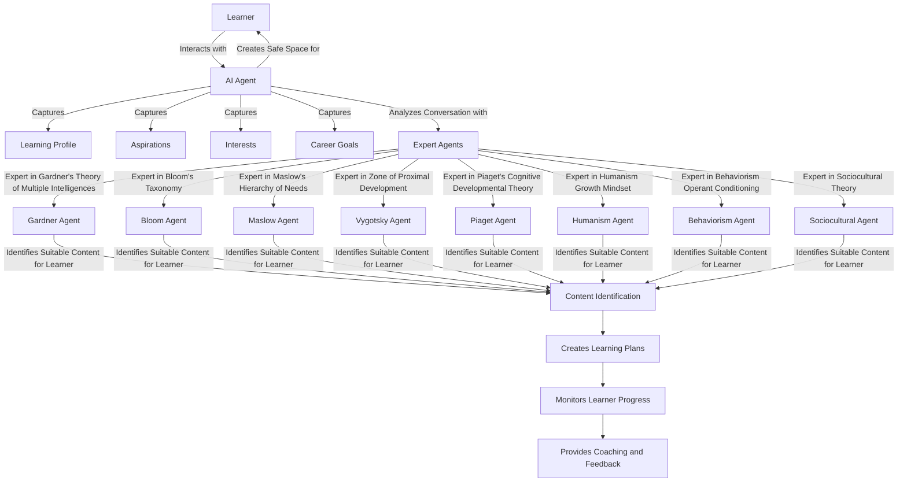

## Workshop 

 Interactive Workshop : Critical Thinking and Problem Solving with AI


1) Apply Design thinking to the learning and development process
 - How can we apply design thinking to learning and development?

2) Design Thinking Framework
 - Pick a design thinking framework that is suitable for learning and development.
 - How can we apply design thinking to learning and development?
 - What are the key stages of design thinking in this context?
   
 5 Stage Design Thinking Framework
   
 - Empathize: Understand the needs of the users.
 - Define: Clearly articulate the problem to be solved.
 - Ideate: Generate a wide range of ideas.
 - Prototype: Build tangible representations of ideas.
 - Test: Evaluate the prototypes with users.

https://www.interaction-design.org/literature/article/design-thinking-a-quick-overview

3) How can we apply design thinking techniques + AI to the problem domain ?
 - How can we use AI to enhance the design thinking process ?
 - What are the key AI tools and techniques that can be applied at each stage of the design thinking framework?
 - How can we ensure that AI solutions are user-centered and aligned with the needs of learners?


 Provide some sample prompts for each stage of the design thinking framework that can be used in the context of learning and development with AI.


## Start Prompting


```text
Can I reframe this question to produce more through results ? what frameworks similar to the bloom taxonomy , maslow hierarchy of needs, and zone of proximal development exist that I should provide in the instructions as best practices ?
I want to generate a list of frameworks that I can use to develop educational programs for learners. 
```


--- Result 
What are some educational frameworks, similar to Bloom's Taxonomy, Maslow's Hierarchy of Needs, and the Zone of Proximal Development, that can be used as best practices for developing educational programs for learners?


```text
Please reframe this question to produce more through results ? 
What educational learning objective & psychological frameworks eg bloom taxonomy , maslow hierarchy of needs, and zone of proximal development can I use as as best practices to develop education learning programs for learners? I want to generate a list of frameworks that I can use to develop educational programs for learners.
```

### Result
```text
What are some effective educational learning objective frameworks, such as Bloom's Taxonomy, Maslow's Hierarchy of Needs, and the Zone of Proximal Development, that can be utilized as best practices for developing comprehensive educational programs for learners?
```

## Version 2
```text
What educational learning objective & psychological frameworks eg bloom taxonomy , maslow hierarchy of needs, and zone of proximal development can I use as as best practices to develop education learning programs for learners? I want to generate a list of frameworks that I can use to develop educational programs for learners.
```

## Follow-up Question
```text
Are there any other frameworks I should consider ?
```


```text 
What educational and psychological frameworks, similar to Bloom's Taxonomy, Maslow's Hierarchy of Needs, and the Zone of Proximal Development, should I consider including in my instructions as best practices? Additionally, should I have agents evaluate and provide input based on each of these frameworks?

```

## Start 
Design an agentic System 
```text
I want to develop a multi-agent learning and development system. The system will interact with learners to capture their learning profiles, aspirations, interests, and career goals. It should create a safe space for learners to communicate and interact with the AI.

The system will analyze conversations in real-time using multiple agents, each an expert in various learning frameworks. These agents will identify suitable content for the user, create personalized learning plans, and monitor the learner's progress. They will also provide coaching and feedback as the learner progresses in their learning journey.

Can you generate a mermaid diagram of the agents and their interactions? Please do not use () or any special characters in the labels of nodes and edges

```


